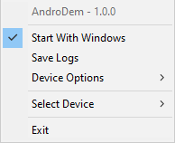

    <!--!-->
   <h1>AndroDem</h1>

  
  
  

<h1 align="center">Description</h1>

**AndroDem** (short of Android Modem) is an application that utilizes [ADB](https://developer.android.com/tools/adb) to gather information about the wifi status of the selected device.

## Features

- Can select device from connected devices
- Disables phone screen when connecting
- Shows wifi status info and phone name: {PhoneName}: {SSID} ({LinkSpeed})
- Can open device shell
- Can enable/disable device display
- Can restart device WiFi

**Images of the app:**  

## FAQ
### **App doesn't show wifi status**
1. Make sure you enabled [ADB debugging](https://developer.android.com/studio/debug/dev-options#enable)
2. Make sure your device is authorized
3. Make sure you selected your device
  